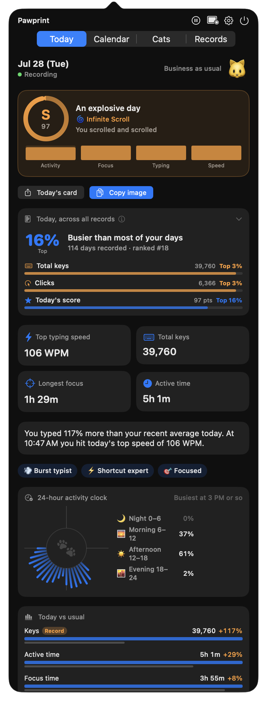
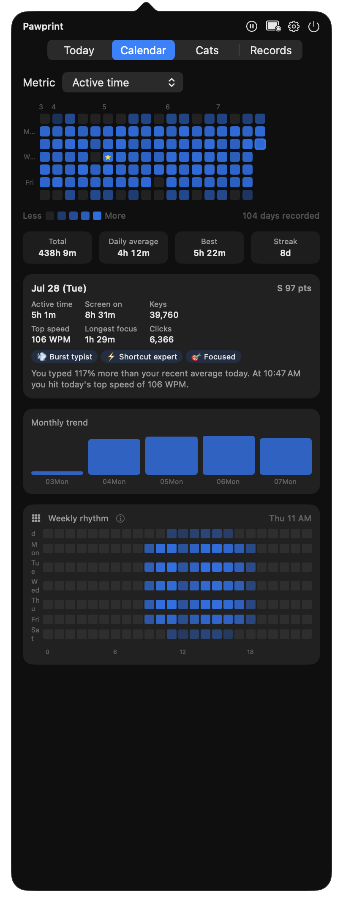
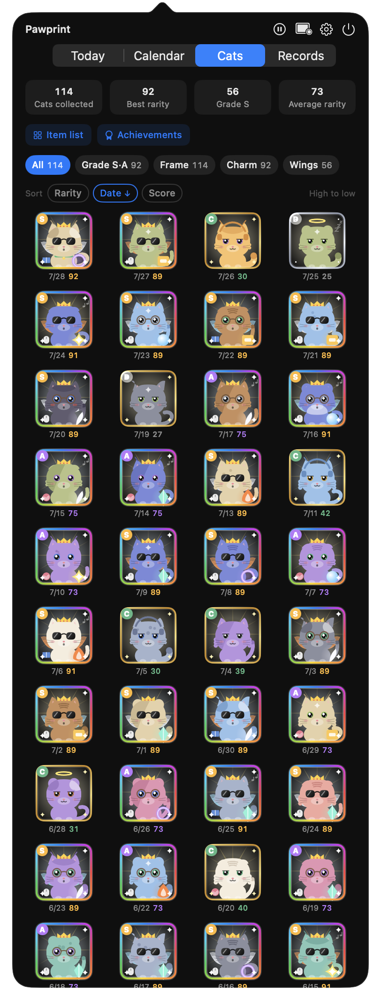
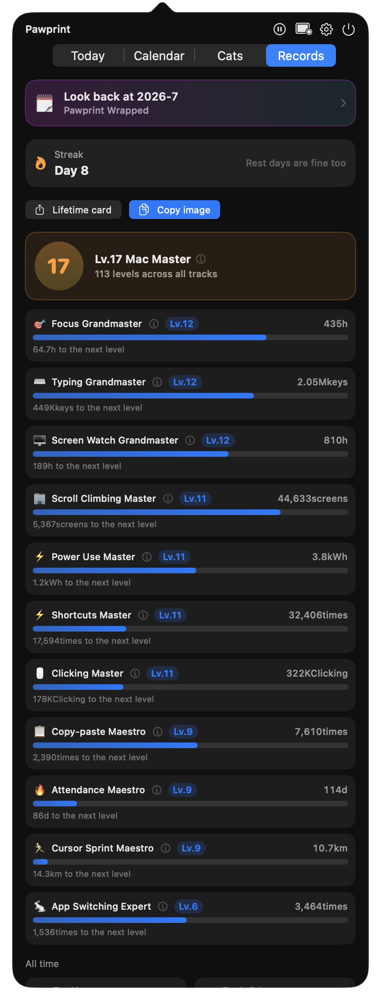
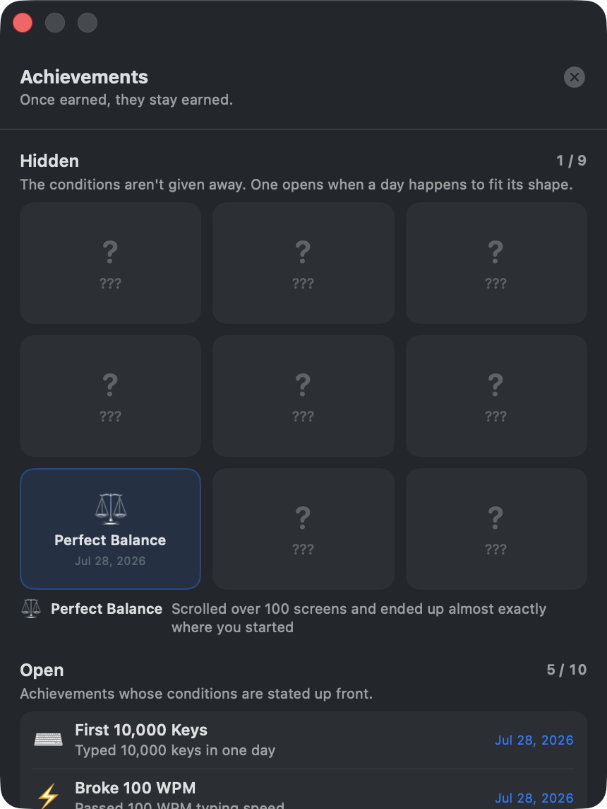
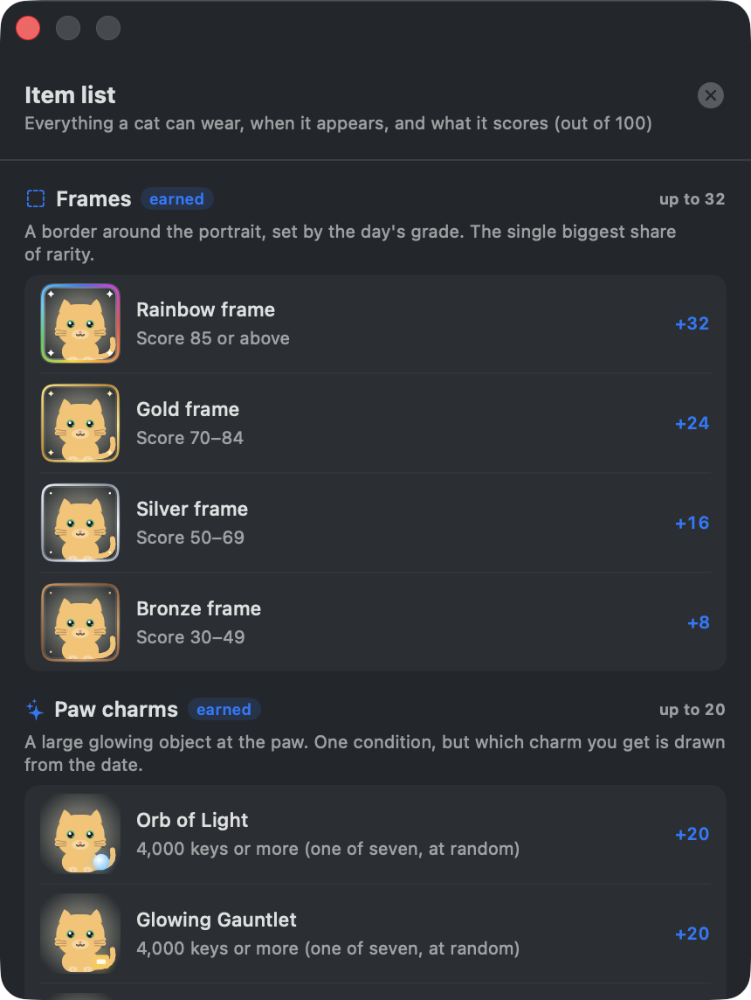

<div align="center">


**English** · [한국어](docs/README.ko.md)

<a href="https://github.com/yhcho0405/Pawprint/releases/latest/download/Pawprint.dmg">

</a>

<br><br>


<a href="https://github.com/yhcho0405/Pawprint/releases/latest"></a>

<br><br>

**Pawprint sits in your menu bar and turns how you used your Mac into a cat.**<br>
Counts and durations only — never what you type. Everything stays on your Mac.

<br>

<table>
<tr>
<td align="center"></td>
<td align="center"></td>
<td align="center"></td>
</tr>
<tr>
<td align="center"><sub>The paw wiggles as you type</sub></td>
<td align="center"><sub>…or a cat, swishing its tail</sub></td>
<td align="center"><sub>…which curls up when you stop</sub></td>
</tr>
</table>

<sub>Both keep pace with how fast you're typing. Pick either in Settings.</sub>

<br>

<table>
<tr>
<td width="50%"></td>
<td width="50%"></td>
</tr>
<tr>
<td align="center"><b>Today</b><br><sub>A score out of 100, the persona your day fits, where it ranks against every day you've recorded, and a 24-hour clock of when you were busy.</sub></td>
<td align="center"><b>Calendar</b><br><sub>Every day coloured by whichever metric you pick. Streaks, averages, and the story of any single day.</sub></td>
</tr>
<tr>
<td></td>
<td></td>
</tr>
<tr>
<td align="center"><b>One cat per day, kept</b><br><sub>Each day generates a cat scored out of 100 for rarity. Sort the collection, or filter down to the days you earned wings.</sub></td>
<td align="center"><b>Levels that never run out</b><br><sub>Eleven tracks with targets that keep growing, plus lifetime totals and a monthly retrospective.</sub></td>
</tr>
<tr>
<td></td>
<td></td>
</tr>
<tr>
<td align="center"><b>Nine hidden achievements</b><br><sub>Empty slots until they fire. Their conditions look for an unusual shape in a day, not a bigger number.</sub></td>
<td align="center"><b>Every item, explained</b><br><sub>What each frame, charm, collar and expression means, when it appears, and what it is worth.</sub></td>
</tr>
</table>


<sub>48 high-grade days — bronze through rainbow frames, seven paw charms, three kinds of wings.<br>
Around <b>171 trillion</b> combinations are reachable.</sub>

</div>

<br>

## What it never stores

- The characters you type, or the order you typed them — the keyboard heatmap counts presses per
  physical key, which is not the same thing: it cannot tell an `a` in a password from an `a` in a
  search box, and holds no sequence to reconstruct either
- Passwords
- Clipboard **contents**
- Screenshots, window titles, document or web page contents
- Long-term raw cursor paths

Data lives in `~/Library/Application Support/Pawprint/` and goes nowhere else.

Pawprint makes two kinds of request, both to GitHub and both behind the same switch in
Settings → Updates: it checks for a new version, and it fetches the notices shown in the popover.
Neither sends anything about you or your Mac. Turn that switch off and the app is entirely
offline. There is no analytics or usage reporting of any kind.

## Permissions

| Permission | Why |
|---|---|
| **Accessibility** | Detect mouse events and app switches |
| **Input Monitoring** | See that a key was pressed, and which physical key it was — never the character it produced |

A setup wizard walks you through both on first launch, and you can reopen it any time from
Settings → General.

Runs on macOS 14 or later, on both Apple Silicon and Intel Macs.

## Updates

Pawprint checks for new versions on its own and offers them in the popover. One click downloads,
verifies and installs.

Every release archive is signed with an Ed25519 key whose public half is compiled into the app.
Nothing is unpacked, let alone run, until that signature checks out — so a substituted download
URL cannot become a substituted app. See [SECURITY.md](SECURITY.md) to verify a download yourself.

## Building from source

**You don't need to.** Building is for people who want to change something — to just use
Pawprint, grab the ready-made app:

<div align="center">
<a href="https://github.com/yhcho0405/Pawprint/releases/latest/download/Pawprint.dmg">

</a>
</div>

Still want to build it yourself?

```bash
git clone https://github.com/yhcho0405/Pawprint.git
cd Pawprint
./scripts/build_app.sh release
open ./build/Pawprint.app
```

To package a `.dmg`:

```bash
./scripts/make_dmg.sh --build
```

The release process is documented in [docs/RELEASING.md](docs/RELEASING.md).

## Troubleshooting

<details>
<summary>macOS won't open the app on first launch</summary>

<br>

Right-click Pawprint in Applications and choose **Open**, then confirm. This is only needed once.

</details>

<details>
<summary>Every counter reads zero</summary>

<br>

Accessibility or Input Monitoring was probably revoked. Settings → General shows the live status
of both, and the setup wizard can be reopened from the same place.

</details>

<details>
<summary>Only modifier keys appear in the heatmap</summary>

<br>

Input Monitoring was granted after Pawprint started, and the listener created before it stays
dead. Turn Pawprint off and on again in System Settings → Privacy & Security → Input Monitoring,
then quit and reopen the app.

</details>

## License

[Apache 2.0](LICENSE)
