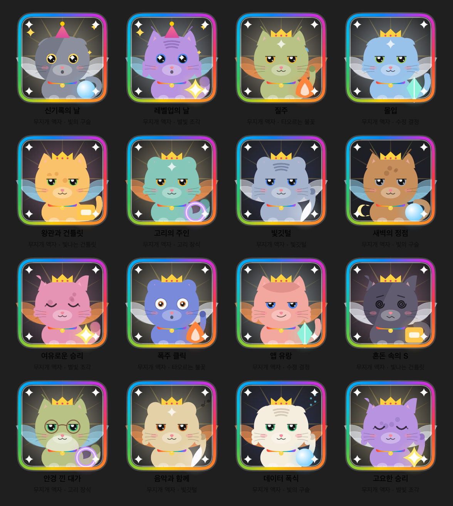

<div align="center">


[English](../README.md) · **한국어**

<br>

<a href="https://github.com/yhcho0405/Pawprint/releases/latest/download/Pawprint.dmg">

</a>

<br><br>


<a href="https://github.com/yhcho0405/Pawprint/releases/latest"></a>

</div>

<br>

Pawprint는 메뉴 바에 조용히 앉아 Mac을 어떻게 쓰는지 기록합니다 — 누른 키, 스크롤한 거리,
집중한 시간, 쓴 배터리까지. 하루가 끝나면 그 전부를 **고양이 한 마리**로 돌려줍니다.

**무엇을 입력했는지는 절대 기록하지 않습니다.** 횟수와 시간, 집계값만 남고, 모든 데이터는
이 Mac에만 있습니다.

<br>

## 고양이

하루에 한 마리가 만들어집니다. 털색은 날짜로 정해져서 자정부터 자정까지 같은 고양이지만,
표정·모자·안경·소품·목걸이·주변 효과가 **각각 다른 지표**를 따라갑니다. 숫자 하나를 여덟 가지로
바꿔 그린 게 아니라, 하루 전체의 요약으로 읽히도록요.

일부는 **얻어야** 나타납니다. 충분히 타이핑하면 발치에 빛나는 장식이 붙고 — 어떤 장식일지는
날짜가 정하는 깜짝 요소입니다. 멀리 이동하면 날개가 돋습니다. 점수가 높으면 액자가 붙습니다:
동·은·금, 그리고 무지개.

<div align="center">

<br>
<sub>최고 등급 고양이 — 무지개 액자, 발 장식, 날개, 빛줄기 배경</sub>
</div>

<br>

각 고양이는 100점 만점의 희귀도와 S~D 등급을 받습니다. **도감**에 쌓이고, 희귀도·날짜·점수순으로
정렬하거나 뭔가 얻어낸 날만 골라 볼 수 있습니다.

나올 수 있는 조합은 약 **171조** 가지입니다.

<br>

## 그 밖에

| | |
|---|---|
| **무한 레벨** | 타건·스크롤·집중·전력 등 11개 트랙, 계속 커지는 목표치. 끝나버리는 체크리스트가 아닙니다. |
| **라이브 HUD** | 실시간 WPM, 세션 시간, 원하는 지표를 띄우는 떠 있는 패널. |
| **활동 달력** | 원하는 지표를 기준으로 하루하루를 색으로. |
| **Pawprint Wrapped** | 한 달을 슬라이드로 돌아보기. |
| **공유 카드** | 오늘 또는 누적 기록을 이미지로 만들어 클립보드에 바로 복사. |
| **키보드 히트맵** | 실제 키보드 배열 위에 어떤 키를 많이 쓰는지 — 횟수만, 글자는 절대 안 남김. |
| **백분위** | 오늘이 지금까지 기록한 모든 날 중 어디쯤인지. |

<br>

## 저장하지 않는 것

- 입력한 글자와 그 순서
- 비밀번호
- 클립보드 **내용**
- 화면 캡처, 창 제목, 문서·웹페이지 내용
- 장기 보관되는 커서 이동 경로

데이터는 `~/Library/Application Support/Pawprint/`에만 있고 어디로도 나가지 않습니다.
인터넷 없이 완전히 동작하며, 유일한 네트워크 요청인 새 버전 확인은 설정 → 업데이트에서 끌 수 있습니다.

<br>

## 필요한 권한

| 권한 | 이유 |
|---|---|
| **손쉬운 사용** | 마우스 이벤트와 앱 전환 감지 |
| **입력 모니터링** | 키를 눌렀다는 *사실*만 감지 — 어떤 키인지는 안 봅니다 |

첫 실행 시 설정 마법사가 안내하고, 설정 → 일반에서 언제든 다시 열 수 있습니다.

<br>

## 업데이트

새 버전이 나오면 앱이 알아서 확인하고 팝오버에 알려줍니다. 한 번 누르면 다운로드·검증·설치까지
끝납니다.

모든 릴리즈 아카이브는 Ed25519 키로 서명되고, 공개키는 앱에 박혀 있습니다. 서명이 확인되기
전에는 압축조차 풀지 않습니다 — 다운로드 주소가 바뀌어도 다른 앱이 설치될 수 없도록.

<br>

## 직접 빌드하기

```bash
git clone https://github.com/yhcho0405/Pawprint.git
cd Pawprint
./scripts/build_app.sh release
open ./build/Pawprint.app
```

`.dmg`로 패키징하려면:

```bash
./scripts/make_dmg.sh --build
```

릴리즈 절차는 [RELEASING.md](RELEASING.md)에 있습니다.

<br>

## 문제 해결

<details>
<summary>처음 실행할 때 macOS가 앱을 열어주지 않아요</summary>

<br>

응용 프로그램에서 Pawprint를 **우클릭 → 열기**를 누르고 확인하세요. 한 번만 하면 됩니다.

</details>

<details>
<summary>모든 수치가 0으로 나와요</summary>

<br>

손쉬운 사용이나 입력 모니터링 권한이 해제됐을 가능성이 큽니다. 설정 → 일반에서 두 권한의
현재 상태를 볼 수 있고, 같은 자리에서 설정 마법사를 다시 열 수 있습니다.

</details>

<br>

## 라이선스

[Apache 2.0](../LICENSE)
