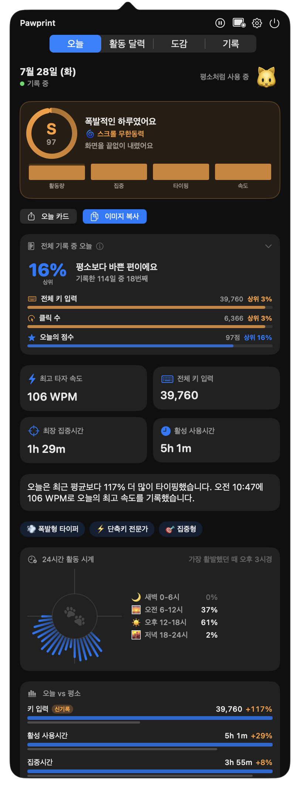
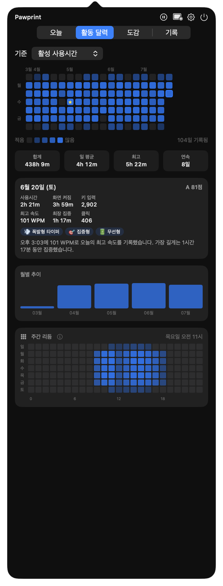
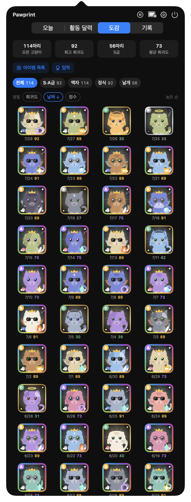
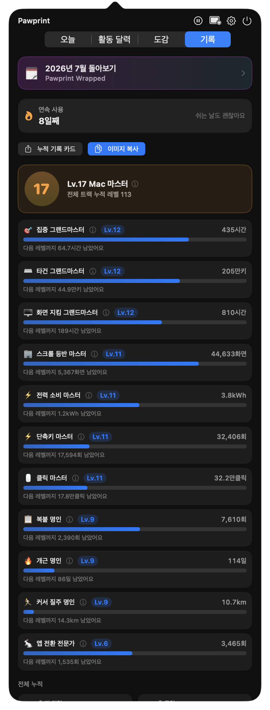
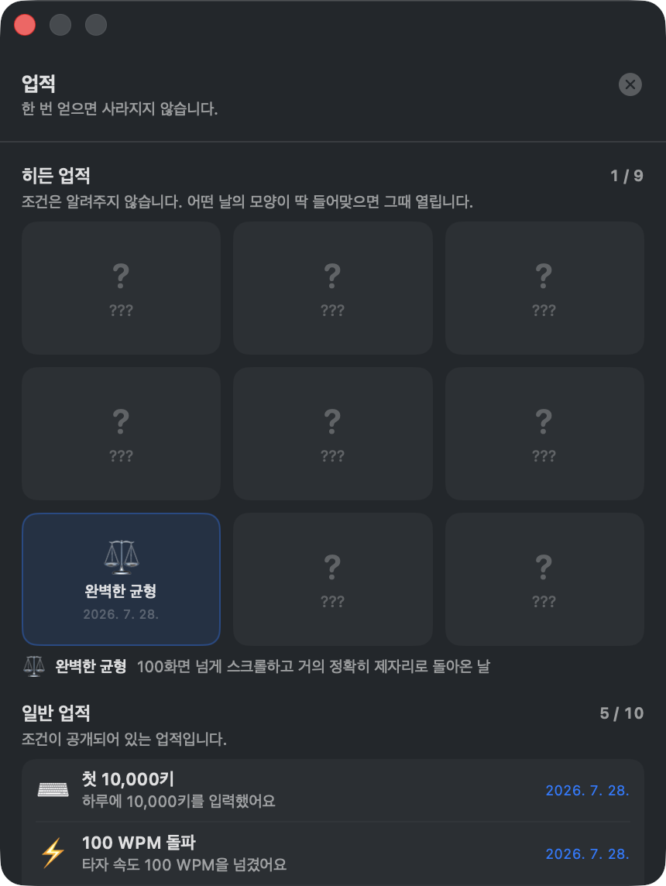
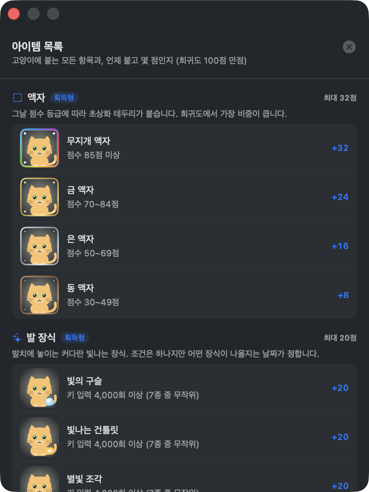

<div align="center">


[English](../README.md) · **한국어**

<a href="https://github.com/yhcho0405/Pawprint/releases/latest/download/Pawprint.dmg">

</a>

<br><br>


<a href="https://github.com/yhcho0405/Pawprint/releases/latest"></a>

<br><br>

**메뉴 막대에 앉아, 오늘 Mac을 어떻게 썼는지를 고양이 한 마리로 돌려줍니다.**<br>
횟수와 시간만 남깁니다 — 무엇을 입력했는지는 절대 기록하지 않고, 모든 데이터는 이 Mac에만 있습니다.

<br>

<table>
<tr>
<td align="center"></td>
<td align="center"></td>
<td align="center"></td>
</tr>
<tr>
<td align="center"><sub>타이핑하면 발바닥이 움직이고</sub></td>
<td align="center"><sub>고양이를 고르면 꼬리를 흔들고</sub></td>
<td align="center"><sub>손을 떼면 웅크려 잠듭니다</sub></td>
</tr>
</table>

<sub>둘 다 타자 속도에 맞춰 빨라집니다. 설정에서 고를 수 있습니다.</sub>

<br>

<table>
<tr>
<td width="50%"></td>
<td width="50%"></td>
</tr>
<tr>
<td align="center"><b>오늘</b><br><sub>100점 만점 점수와 그날의 유형, 지금까지 기록한 모든 날 중 몇 번째인지, 그리고 언제 바빴는지를 보여주는 24시간 시계.</sub></td>
<td align="center"><b>활동 달력</b><br><sub>원하는 지표를 기준으로 하루하루를 색으로. 연속 기록과 평균, 그리고 특정 하루의 이야기까지.</sub></td>
</tr>
<tr>
<td></td>
<td></td>
</tr>
<tr>
<td align="center"><b>하루에 한 마리, 모아둡니다</b><br><sub>매일 100점 만점 희귀도로 채점된 고양이가 생깁니다. 정렬하거나, 날개를 얻어낸 날만 골라 볼 수 있습니다.</sub></td>
<td align="center"><b>끝나지 않는 레벨</b><br><sub>목표치가 계속 커지는 11개 트랙, 누적 기록, 그리고 한 달을 돌아보는 회고.</sub></td>
</tr>
<tr>
<td></td>
<td></td>
</tr>
<tr>
<td align="center"><b>히든 업적 9개</b><br><sub>열리기 전까지는 빈 칸입니다. 조건은 더 큰 숫자가 아니라 그날의 특이한 모양을 봅니다.</sub></td>
<td align="center"><b>모든 아이템 설명</b><br><sub>액자·발 장식·목걸이·표정이 각각 무엇이고, 언제 붙고, 몇 점인지.</sub></td>
</tr>
</table>


<sub>높은 등급의 하루 48개 — 동부터 무지개까지의 액자, 7가지 발 장식, 3가지 날개.<br>
나올 수 있는 조합은 약 <b>171조</b> 가지입니다.</sub>

</div>

<br>

## 저장하지 않는 것

- 입력한 글자와 그 순서 — 키보드 히트맵은 물리 키별 횟수만 셉니다. 비밀번호의 `a`와 검색창의 `a`를
  구분할 수 없고, 순서도 남지 않아 무엇을 쳤는지 되살릴 수 없습니다
- 비밀번호
- 클립보드 **내용**
- 화면 캡처, 창 제목, 문서·웹페이지 내용
- 장기 보관되는 커서 이동 경로

데이터는 `~/Library/Application Support/Pawprint/`에만 있고 어디로도 나가지 않습니다.

네트워크 요청은 두 종류뿐이고 둘 다 GitHub으로만 갑니다 — 새 버전 확인과, 팝오버에 뜨는 공지 받아오기.
둘 다 설정 → 업데이트의 같은 스위치로 함께 꺼지고, 사용자나 기기에 대한 정보는 아무것도 보내지 않습니다.
꺼두면 앱은 완전히 오프라인으로 동작합니다. 사용 통계 수집 기능은 없습니다.

## 필요한 권한

| 권한 | 이유 |
|---|---|
| **손쉬운 사용** | 마우스 이벤트와 앱 전환 감지 |
| **입력 모니터링** | 키를 눌렀다는 사실과 어떤 *물리 키*인지 감지 — 그 키가 만들어낸 글자는 보지 않습니다 |

첫 실행 시 설정 마법사가 안내하고, 설정 → 일반에서 언제든 다시 열 수 있습니다.

macOS 14 이상에서 동작하며, Apple Silicon과 Intel Mac 모두 지원합니다.

## 업데이트

새 버전이 나오면 앱이 알아서 확인하고 팝오버에 알려줍니다. 한 번 누르면 다운로드·검증·설치까지
끝납니다.

모든 릴리즈 아카이브는 Ed25519 키로 서명되고, 공개키는 앱에 박혀 있습니다. 서명이 확인되기
전에는 압축조차 풀지 않습니다 — 다운로드 주소가 바뀌어도 다른 앱이 설치될 수 없도록. 직접 검증하는
방법은 [SECURITY.md](../SECURITY.md)에 있습니다.

## 직접 빌드하기

**직접 빌드할 필요 없습니다.** 이 항목은 코드를 고치려는 분들을 위한 것이고, 그냥 쓰실 거라면
완성된 앱을 받으시면 됩니다:

<div align="center">
<a href="https://github.com/yhcho0405/Pawprint/releases/latest/download/Pawprint.dmg">

</a>
</div>

그래도 직접 빌드하시려면:

```bash
git clone https://github.com/yhcho0405/Pawprint.git
cd Pawprint
./scripts/build_app.sh release
open ./build/Pawprint.app
```

`.dmg`로 패키징하려면:

```bash
./scripts/make_dmg.sh --build
```

릴리즈 절차는 [RELEASING.md](RELEASING.md)에 있습니다.

## 문제 해결

<details>
<summary>처음 실행할 때 macOS가 앱을 열어주지 않아요</summary>

<br>

응용 프로그램에서 Pawprint를 **우클릭 → 열기**를 누르고 확인하세요. 한 번만 하면 됩니다.

</details>

<details>
<summary>모든 수치가 0으로 나와요</summary>

<br>

손쉬운 사용이나 입력 모니터링 권한이 해제됐을 가능성이 큽니다. 설정 → 일반에서 두 권한의
현재 상태를 볼 수 있고, 같은 자리에서 설정 마법사를 다시 열 수 있습니다.

</details>

<details>
<summary>히트맵에 수정키만 나와요</summary>

<br>

Pawprint가 실행된 뒤에 입력 모니터링을 허용하면, 그 전에 만들어진 감시자는 되살아나지 않습니다.
시스템 설정 → 개인정보 보호 및 보안 → 입력 모니터링에서 Pawprint를 껐다 켜고, 앱을 완전히 종료한 뒤
다시 실행하세요.

</details>

## 라이선스

[Apache 2.0](../LICENSE)
